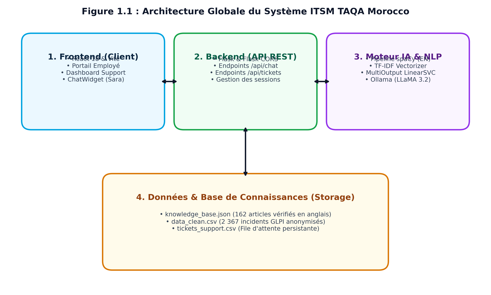
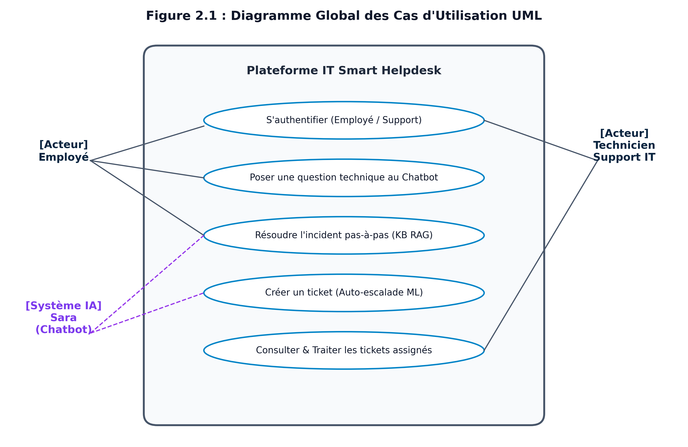
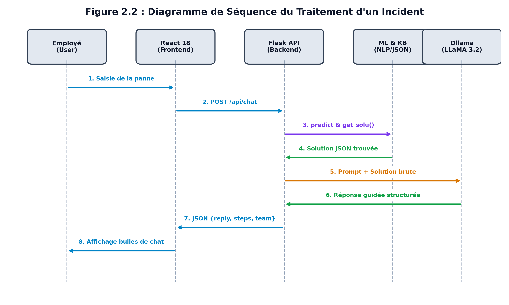
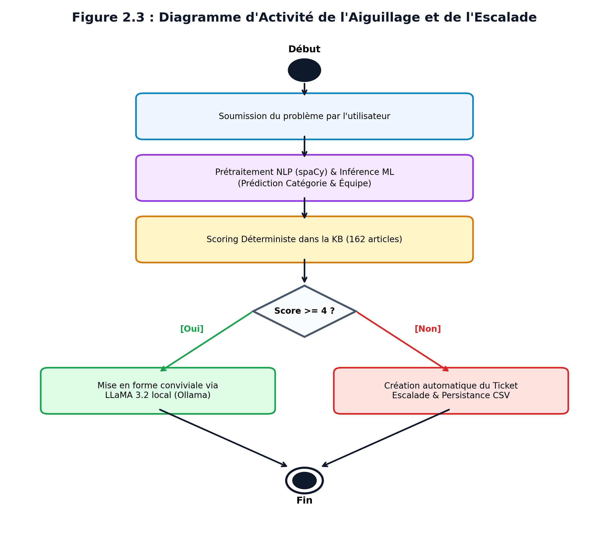
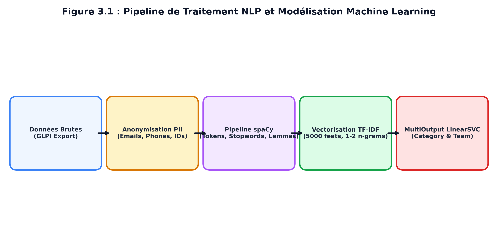
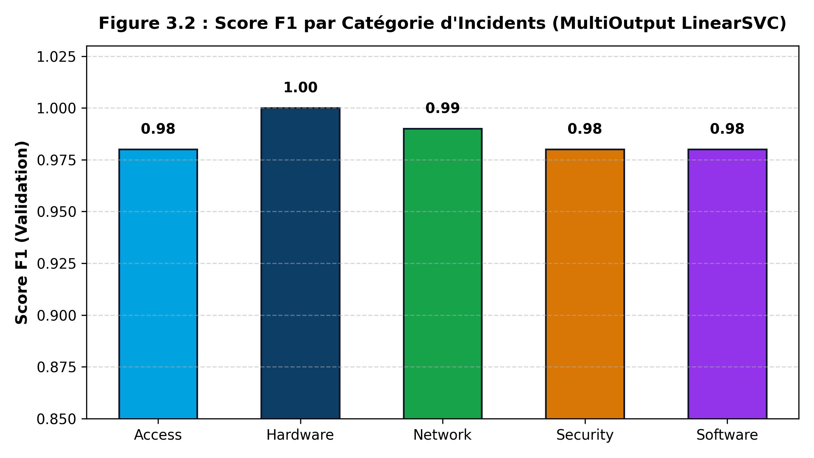
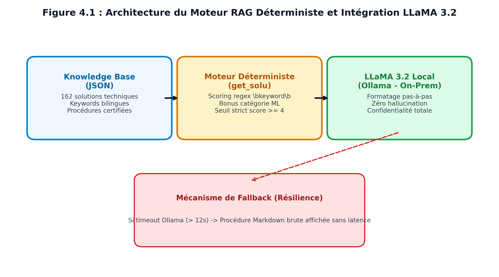

المملكة المغربية — جامعة ابن زهر

المدرسة الوطنية العليا للذكاء الاصطناعي وعلوم المعطيات - تارودانت

ÉCOLE NATIONALE SUPÉRIEURE DE L'INTELLIGENCE ARTIFICIELLE
ET SCIENCES DES DONNÉES - TAROUDANT

RAPPORT DE STAGE / PROJET DE FIN D'ANNÉE

Filière : « Sciences des Données, Big Data & IA / Sécurité IT et Confiance Numérique / Management et Gouvernance des Systèmes d’Information / Ingénierie Logicielle »


> **THEME DU STAGE / PROJET :
CONCEPTION ET DÉPLOIEMENT D'UNE PLATEFORME ITSM INTELLIGENTE BASÉE SUR LE NLP (SPACY), LE MACHINE LEARNING MULTI-SORTIES ET UN AGENT CONVERSATIONNEL LLM (LLAMA 3.2 / RAG DÉTERMINISTE) : APPLICATION AU SUPPORT TECHNIQUE DE TAQA MOROCCO**


Présenté par :

Mohammed REGRAGUI

Soutenu le : Juin 2025 devant le jury composé de :


| Titre | Affiliation institutionnelle | Rôle du Jury |
| --- | --- | --- |

| Pr. | Professeur à l' ENSIASD de Taroudant | Président |

| Pr. | Professeur à l' ENSIASD de Taroudant | Examinateur |

| Pr. | Professeur à l' ENSIASD de Taroudant | Examinateur |

| Pr. | Professeur à l' ENSIASD de Taroudant | Encadrant |

| Pr/Mr | Etablissement d'accueil : TAQA Morocco | Encadrant |


**Établissement d'accueil :** TAQA Morocco (Centrale Thermique de Jorf Lasfar)


Année Universitaire 2024- 2025


# DEDICACES

À mes chers parents, dont l'amour inconditionnel, les sacrifices constants et les prières bienveillantes ont illuminé mon parcours et m'ont donné la force de persévérer face à chaque défi.

À mes frères et sœurs, pour leur tendresse, leur encouragement indéfectible et leur soutien précieux à chaque instant.

À l'ensemble de mes enseignants et encadrants de l'ENSIASD de Taroudant, qui ont su transmettre avec générosité leur rigueur scientifique, leur passion pour l'Intelligence Artificielle et leur vision de l'excellence.

À tous mes amis et collègues de promotion, en souvenir des moments intenses de partage, d'entraide et de camaraderie vécus tout au long de nos études.


# REMERCIEMENTS

Au terme de ce projet de fin d'année, j'exprime ma profonde gratitude et mes sincères remerciements à toutes les personnes qui ont contribué, de près ou de loin, à l'accomplissement et à la réussite de ce travail.

Je tiens tout d'abord à remercier chaleureusement la direction générale et l'équipe informatique de **TAQA Morocco** pour m'avoir ouvert leurs portes au sein de la Centrale Thermique de Jorf Lasfar. Cet environnement industriel d'envergure m'a offert un cadre d'apprentissage exceptionnel et particulièrement stimulant.

J'adresse mes remerciements les plus respectueux à mon encadrant professionnel au sein de TAQA Morocco, pour son accueil, son encadrement bienveillant, ses orientations techniques pointues et la confiance qu'il m'a accordée tout au long de cette mission.

Mes vifs remerciements vont également à mon encadrant pédagogique à l'**ENSIASD de Taroudant**, pour sa disponibilité permanente, ses conseils avisés et sa rigueur méthodologique qui ont guidé mes recherches.

Enfin, j'exprime ma reconnaissance aux honorables membres du jury d'avoir accepté d'examiner et d'évaluer ce travail de fin d'année.


# RESUME

Dans un environnement industriel hautement stratégique tel que celui de **TAQA Morocco**, premier producteur privé d'électricité au Royaume (fournissant près de 40% de la demande nationale), la disponibilité permanente des infrastructures informatiques et des systèmes de production énergétique est primordiale. Face à l'augmentation du volume des demandes de support technique et aux limites inhérentes aux Help Desks traditionnels (saturation des canaux d'assistance, temps de résolution prolongés et erreurs récurrentes d'aiguillage des incidents), ce projet de fin d'année présente la conception et le déploiement d'une plateforme ITSM (*IT Service Management*) intelligente et automatisée : **TAQA IT Smart Helpdesk**.

La solution développée combine trois piliers technologiques complémentaires :
1. **Un pipeline de traitement automatique du langage naturel (NLP) sous spaCy** intégrant le masquage systématique des informations personnelles identifiables (PII) et une lemmatisation linguistique avancée des termes techniques.
2. **Un modèle de Machine Learning supervisé multi-sorties** (*MultiOutputClassifier* basé sur *LinearSVC* et vectorisation *TF-IDF* unigrammes/bigrammes) capable de prédire simultanément la Catégorie et l'Équipe support assignée avec une exactitude de **98,52%** sur un historique réel de **2 367 tickets**.
3. **Un moteur de recherche déterministe couplé à un grand modèle de langage local (LLaMA 3.2 exécuté via Ollama)** et à une base de connaissances bilingue enrichie de **162 procédures techniques d'entreprise**, offrant une assistance guidée pas-à-pas à l'employé avec un mécanisme d'escalade automatique en cas d'incident non répertorié.

L'ensemble de ces briques est intégré au sein d'une interface web moderne et réactive développée en **React 18 / Vite** et orchestrée par une API REST sécurisée sous **Flask**.

**Mots-clés :** ITSM, Support Informatique, Traitement Automatique du Langage Naturel (NLP), spaCy, Machine Learning, MultiOutputClassifier, LinearSVC, TF-IDF, RAG Déterministe, LLaMA 3.2, Ollama, React 18, Flask, TAQA Morocco.


## ABSTRACT

In a critical industrial energy environment such as **TAQA Morocco**, the kingdom's leading private electricity producer (supplying approximately 40% of national electricity demand), continuous availability of IT and plant systems is crucial. To overcome traditional helpdesk challenges—namely ticket backlog, prolonged resolution times, and misrouted requests—this capstone project introduces an enterprise-grade AI-powered ITSM platform: **TAQA IT Smart Helpdesk**.

The system is built upon three core technological layers:
1. **An NLP preprocessing pipeline leveraging spaCy**, featuring automated PII masking (names, emails, extensions, IP addresses) and domain-specific lemmatization.
2. **A multi-output Machine Learning classifier** (*MultiOutputClassifier* wrapping *LinearSVC* with *TF-IDF* n-grams) that concurrently predicts Incident Category and Assigned Support Team, achieving an outstanding accuracy of **98.52%** on a production dataset of **2,367 historical tickets**.
3. **A deterministic retrieval engine coupled with an On-Premise Large Language Model (LLaMA 3.2 via Ollama)** and a bilingual knowledge base of **162 structured enterprise technical solutions**, delivering step-by-step interactive guidance with automatic ticket escalation for uncatalogued issues.

The platform is delivered through a modern **React 18 / Vite** Single Page Application integrated with a lightweight **Flask REST API**.

**Keywords:** ITSM, IT Support, Natural Language Processing (NLP), spaCy, Machine Learning, MultiOutputClassifier, LinearSVC, TF-IDF, Deterministic RAG, LLaMA 3.2, Ollama, React 18, Flask, TAQA Morocco.


# INTRODUCTION GENERALE

À l'ère de la transformation numérique des grandes industries, l'efficacité des infrastructures informatiques conditionne directement la continuité et la sûreté des opérations. Dans le secteur hautement sensible de la production d'énergie, où la moindre anomalie matérielle, réseau ou applicative peut perturber la supervision des unités thermiques, le Centre de Services Informatiques (Help Desk) constitue le premier rempart opérationnel.

Cependant, la gestion conventionnelle des incidents informatiques se heurte quotidiennement à des défis majeurs : un volume croissant de sollicitations répétitives à faible valeur ajoutée, des descriptions formulées en langage naturel souvent imprécises, et des erreurs d'aiguillage des tickets entre équipes techniques entraînant une augmentation préjudiciable du temps moyen de résolution (*Mean Time To Resolution - MTTR*). Chez **TAQA Morocco**, ces problématiques représentent un enjeu stratégique d'optimisation de la productivité des collaborateurs et de réduction de la charge cognitive des ingénieurs de support.

C'est dans cette perspective que s'inscrit notre projet de fin d'année réalisé au sein de la Direction des Systèmes d'Information de TAQA Morocco, en collaboration avec l'**École Nationale Supérieure de l'Intelligence Artificielle et Sciences des Données (ENSIASD) de Taroudant**. Ce projet a pour finalité la conception et la mise en production de **TAQA IT Smart Helpdesk**, un écosystème logiciel intelligent combinant l'analyse prédictive par Machine Learning, le traitement automatique du langage naturel (NLP), et un agent conversationnel autonome adossé à un grand modèle de langage (*LLM*) souverain déployé localement.

Le présent mémoire s'articule autour de cinq chapitres méthodologiques :
- **Le Chapitre 1** présente le cadre institutionnel de TAQA Morocco, analyse les dysfonctionnements du Help Desk existant et dresse l'état de l'art sur l'application de l'IA à l'ITSM.
- **Le Chapitre 2** formalise la spécification des besoins fonctionnels et techniques et détaille la conception du système à l'aide des diagrammes UML et de l'architecture 3-tiers.
- **Le Chapitre 3** est consacré au pipeline de prétraitement NLP (spaCy), à l'anonymisation des données confidentielles et à l'entraînement du modèle prédictif multi-sorties (*LinearSVC*).
- **Le Chapitre 4** décrit le moteur de recherche déterministe (*RAG*), l'intégration locale du LLM LLaMA 3.2 via Ollama, l'enrichissement de la base de connaissances à 162 solutions et le mécanisme d'escalade automatique.
- **Le Chapitre 5** expose la réalisation pratique de l'application web en React 18, l'intégration de la charte visuelle de TAQA, les tests d'intégration et les procédures de déploiement.
Enfin, une conclusion générale récapitule les résultats obtenus et ouvre des perspectives prometteuses pour l'évolution de la solution.


# TABLE DES MATIERES

DÉDICACES ...................................................................... 3

REMERCIEMENTS .................................................................. 4

RÉSUMÉ & ABSTRACT .............................................................. 5

INTRODUCTION GÉNÉRALE .......................................................... 6

TABLE DES MATIÈRES ............................................................. 7

LISTE DES ABRÉVIATIONS ......................................................... 8

LISTE DES FIGURES .............................................................. 9

LISTE DES TABLEAUX ............................................................ 10

CHAPITRE 1 : CONTEXTE GÉNÉRAL ET ÉTAT DE L'ART ................................ 11

    I. Introduction ........................................................... 11

    II. Organisme d'accueil : TAQA Morocco .................................... 11

        II. 1 Présentation générale et secteur d'activité ..................... 11

        II. 1 .2 Rôle stratégique du Système d'Information chez TAQA .......... 11

        II. 1. 3 Cadre de gouvernance et sécurité industrielle ................ 12

    II. 2 Contexte du projet et analyse de l'existant ......................... 12

        II. 2. 1 La gestion des incidents IT selon le référentiel ITIL ........ 12

    II. 3 Problématique et dysfonctionnements du Help Desk traditionnel ....... 12

    III. Objectifs et périmètre du projet ..................................... 13

        III. 1 Automatisation du self-service et réduction du MTTR ............ 13

        III. 1. 1 Approche hybride Machine Learning et RAG souverain .......... 13

    IV. État de l'art sur l'ITSM et l'Intelligence Artificielle ............... 14

    V. Méthodologie adoptée (Agile Scrum) ..................................... 15

    VI. Conclusion du chapitre ................................................ 15

CHAPITRE 2 : ANALYSE DES BESOINS ET CONCEPTION DU SYSTÈME ..................... 16

    I. Introduction ........................................................... 16

    II. Spécification des besoins ............................................. 16

        II. 1 Besoins fonctionnels ............................................ 16

        II. 1 .2 Besoins des employés demandeurs .............................. 16

        II. 1. 3 Besoins des techniciens et superviseurs IT ................... 17

        II. 2 Besoins non-fonctionnels ........................................ 17

    III. Modélisation UML ..................................................... 18

        III. 1 Diagramme global des cas d'utilisation ......................... 18

        III. 2 Diagramme de séquence système : Résolution par Sara ............ 19

        III. 3 Diagramme d'activité de l'aiguillage intelligent ............... 20

    IV. Architecture globale 3-tiers du système ............................... 21

    V. Conclusion du chapitre ................................................. 21

CHAPITRE 3 : PRÉTRAITEMENT NLP, PIPELINE SPACY ET MODÉLISATION ML ............. 22

    I. Introduction ........................................................... 22

    II. Description du jeu de données GLPI (2 367 tickets) .................... 22

        II. 1 Structure et distribution des classes ........................... 22

        II. 1 .2 Analyse exploratoire des données ............................. 23

    II. 2 Pipeline de nettoyage et d'anonymisation PII (cleanup.py) ........... 23

        II. 2. 1 Masquage des identifiants personnels (PII) ................... 23

    II. 3 Traitement linguistique avec spaCy (en_core_web_sm) ................. 24

    III. Extraction des caractéristiques : Vectorisation TF-IDF ............... 25

    IV. Modélisation prédictive multi-sorties ................................. 25

        IV. 1 Algorithme LinearSVC et méta-estimateur MultiOutputClassifier ... 25

        IV. 2 Optimisation des hyperparamètres par GridSearchCV ............... 26

    V. Résultats expérimentaux et évaluation .................................. 26

    VI. Conclusion du chapitre ................................................ 28

CHAPITRE 4 : MOTEUR RAG DÉTERMINISTE, AGENT LLM ET BASE DE CONNAISSANCES ...... 29

    I. Introduction ........................................................... 29

    II. Conception de la base de connaissances IT (162 solutions) ............. 29

        II. 1 Taxonomie et répartition des fiches techniques .................. 29

        II. 2 Structure normalisée des fiches techniques JSON ................. 30

    III. Moteur de recherche déterministe (Fonction get_solu) ................. 30

        III. 1 Algorithme de scoring par word-boundaries et normalisation ..... 30

    IV. Agent conversationnel LLaMA 3.2 via Ollama local ...................... 31

        IV. 1 Intégration souveraine On-Premise ............................... 31

        IV. 1 .2 Rôle et Prompt Engineering de l'agente Sara .................. 32

        IV. 1. 3 Résilience et mécanisme de fallback en cas de timeout ........ 32

    V. Mécanisme d'escalade automatique des tickets ........................... 33

    VI. Conclusion du chapitre ................................................ 33

CHAPITRE 5 : RÉALISATION, INTERFACES UTILISATEURS ET DÉPLOIEMENT .............. 34

    I. Introduction ........................................................... 34

    II. Environnement technique et pile logicielle ............................ 34

    III. Présentation des interfaces de la solution ........................... 35

        III. 1 Module d'authentification et contrôle d'accès .................. 35

        III. 1 .2 Portail Employé et formulaire intelligent en temps réel ..... 35

        III. 2 Widget conversationnel Sara (ChatWidget.jsx) ................... 36

        III. 2. 1 Tableau de bord Superviseur / Technicien .................... 37

    IV. Intégration de l'identité visuelle de TAQA Morocco .................... 37

    V. Tests d'intégration et scénarios de validation ......................... 38

    VI. Déploiement et script de démarrage (run_project.bat) .................. 39

    VII. Conclusion du chapitre ............................................... 39

CONCLUSION GÉNÉRALE ET PERSPECTIVES ........................................... 40

BIBLIOGRAPHIE ET WEBOGRAPHIE .................................................. 42

ANNEXES ....................................................................... 44

    Annexe A : Échantillons de fiches techniques (Base de connaissances) ...... 44

    Annexe B : Extraits de code des algorithmes clés .......................... 46


# LISTE DES ABREVIATIONS


**Liste exhaustive des sigles et abréviations**


| Abréviation | Signification complète |
| --- | --- |
| API | Application Programming Interface (Interface de Programmation d'Application) |
| CORS | Cross-Origin Resource Sharing |
| CPU | Central Processing Unit (Unité Centrale de Traitement) |
| CSS | Cascading Style Sheets |
| CSV | Comma-Separated Values |
| DLP | Data Loss Prevention (Prévention des Fuites de Données) |
| DMZ | Demilitarized Zone (Zone Démilitarisée) |
| EDR | Endpoint Detection and Response |
| ERP | Enterprise Resource Planning (Progiciel de Gestion Intégré) |
| GLPI | Gestionnaire Libre de Parc Informatique |
| HTML | HyperText Markup Language |
| HTTP | Hypertext Transfer Protocol |
| IAM | Identity and Access Management (Gestion des Identités et des Accès) |
| IP | Internet Protocol |
| ITIL | Information Technology Infrastructure Library |
| ITSM | Information Technology Service Management |
| JSON | JavaScript Object Notation |
| KB | Knowledge Base (Base de Connaissances) |
| LLM | Large Language Model (Grand Modèle de Langage) |
| MFA | Multi-Factor Authentication (Authentification Multi-Facteurs) |
| ML | Machine Learning (Apprentissage Automatique) |
| MTTR | Mean Time To Resolution (Temps Moyen de Résolution) |
| NLP | Natural Language Processing (Traitement Automatique du Langage Naturel) |
| OT | Operational Technology (Technologies Opérationnelles / Industrielles) |
| PII | Personally Identifiable Information (Données Personnelles Identifiables) |
| RAG | Retrieval-Augmented Generation |
| REST | Representational State Transfer |
| SAP | Systems, Applications, and Products in Data Processing |
| SLA | Service Level Agreement (Accord de Niveau de Service) |
| SPA | Single Page Application (Application Web Monopage) |
| SVC | Support Vector Classifier |
| SVM | Support Vector Machine |
| TF-IDF | Term Frequency - Inverse Document Frequency |
| UML | Unified Modeling Language |
| VPN | Virtual Private Network (Réseau Privé Virtuel) |


# LISTE DES FIGURES

Figure : 1.1 : Architecture Globale du Système ITSM TAQA Morocco ................. 13

Figure : 2.1 : Diagramme Global des Cas d'Utilisation UML ........................ 18

Figure : 2.2 : Diagramme de Séquence du Traitement d'un Incident ................. 19

Figure : 2.3 : Diagramme d'Activité de l'Aiguillage et de l'Escalade ............. 20

Figure : 3.1 : Pipeline de Traitement NLP et Modélisation Machine Learning ....... 24

Figure : 3.2 : Score F1 par Catégorie d'Incidents (MultiOutput LinearSVC) ........ 27

Figure : 4.1 : Architecture du Moteur RAG Déterministe et Intégration LLaMA 3.2 .. 31


# LISTE DES TABLEAUX

Tableau 1. 1 : Comparatif des approches d'assistance ITSM (Support classique vs Chatbot IA) .. 14

Tableau 2. 1 : Matrice de traçabilité des exigences fonctionnelles ............... 17

Tableau 3. 1 : Structure et champs du jeu de données brut GLPI (tickets d'incidents) .. 22

Tableau 3. 2 : Règles et expressions régulières de masquage PII appliquées par cleanup.py .. 23

Tableau 3. 3 : Rapport de classification détaillé par Catégorie (Test Set - 474 tickets) .. 26

Tableau 3. 4 : Rapport de classification détaillé par Équipe Support (Test Set - 474 tickets) .. 27

Tableau 4. 1 : Répartition des 162 procédures techniques de la base de connaissances par équipe .. 29

Tableau 4. 2 : Pondération et barème de scoring du moteur de recherche déterministe .. 30

Tableau 5. 1 : Environnement logiciel et versions des technologies employées ..... 34

Tableau 5. 2 : Synthèse des scénarios de validation fonctionnelle bout-en-bout ... 38


# CHAPITRE 1 : CONTEXTE GÉNÉRAL ET ÉTAT DE L'ART


## I. Introduction

Ce premier chapitre pose les fondements contextuels, organisationnels et théoriques de notre projet de fin d'année. Nous présentons dans un premier temps l'organisme d'accueil, TAQA Morocco, ainsi que l'importance stratégique de son système d'information. Nous détaillons ensuite le fonctionnement actuel de la gestion des incidents informatiques, les limitations observées et les objectifs assignés à notre solution. Enfin, nous dressons un état de l'art exhaustif des techniques d'Intelligence Artificielle appliquées aux centres de services IT avant de présenter la démarche méthodologique adoptée.


## II. Organisme d'accueil : TAQA Morocco


### II. 1 Présentation générale et secteur d'activité

Filiale du groupe énergétique émirati TAQA (*Abu Dhabi National Energy Company*), **TAQA Morocco** est le premier producteur privé d'électricité au Maroc. Implantée à Jorf Lasfar (province d'El Jadida), la centrale thermique à charbon propre de l'entreprise comprend six unités de production d'une capacité installée totale de **2 056 MW**, fournissant près de **40% de la demande nationale en électricité** de l'Office National de l'Électricité et de l'Eau Potable (ONEE). L'excellence opérationnelle, la sécurité industrielle et la continuité de service constituent les piliers intangibles de sa mission stratégique au service de l'économie marocaine.


#### II. 1 .2 Rôle stratégique du Système d'Information chez TAQA

Le Système d'Information (SI) de TAQA Morocco ne se limite pas à des fonctions administratives de bureautique ; il irrigue l'ensemble de la chaîne de valeur :
- **L'ERP SAP S/4HANA & ECC** : gestion de la maintenance industrielle (module PM), gestion des stocks et pièces de rechange (module MM), contrôle financier et achats.
- **Les réseaux industriels et administratifs** : interconnexion sécurisée entre les réseaux IT d'entreprise et les réseaux OT (*Operational Technology* / SCADA) via des passerelles et DMZ étanches.
- **La sécurité de l'information (ISO 27001)** : surveillance continue par le SOC, politiques strictes de contrôle d'accès (IAM, MFA), chiffrement BitLocker des postes et prévention des fuites de données (DLP).
Dans un tel cadre, la moindre panne informatique d'un poste de travail, d'un accès SAP ou d'une liaison réseau peut paralyser des flux de travail critiques.


#### II. 1. 3 Cadre de gouvernance et sécurité industrielle

En tant qu'opérateur d'infrastructure d'importance vitale (OIV), TAQA Morocco est soumis à des règles de conformité strictes édictées par la Direction Générale de la Sécurité des Systèmes d'Information (DGSSI) et la Commission Nationale de contrôle de la protection des Données à caractère Personnel (CNDP - Loi 09-08). Tout système informatique doit garantir la souveraineté des données internes et exclure formellement l'envoi de données d'entreprise non chiffrées vers des clouds publics non agréés.


## II. 2 Contexte du projet et analyse de l'existant


### II. 2. 1 La gestion des incidents IT selon le référentiel ITIL

La Direction des Systèmes d'Information de TAQA Morocco aligne ses processus de support sur les bonnes pratiques de la bibliothèque **ITIL (Information Technology Infrastructure Library)** version 4. Selon ITIL, un incident est défini comme une interruption non planifiée ou une dégradation de la qualité d'un service IT. L'objectif premier de la Gestion des Incidents est de rétablir le service opérationnel normal le plus rapidement possible, tout en minimisant l'impact négatif sur les activités métiers.


## II. 3 Problématique et dysfonctionnements du Help Desk traditionnel

L'audit des pratiques opérationnelles existantes a mis en lumière plusieurs goulots d'étranglement :
1. **Charge écrasante sur les techniciens** : Plus de 65% des tickets enregistrés concernent des requêtes récurrentes de niveau 1 (ex. mot de passe oublié, câble d'écran débranché, cache d'application saturé, certificat VPN révoqué).
2. **Mauvaise qualification des incidents** : Les utilisateurs finaux expriment leurs pannes en langage naturel souvent imprécis (ex: « mon PC est bloqué », « rien ne marche »). Cela conduit à des erreurs fréquentes d'attribution dans l'outil de gestion des tickets (GLPI).
3. **Temps de latence d'aiguillage** : Un ticket mal qualifié transite par 2 ou 3 équipes différentes avant d'atteindre le bon spécialiste (par exemple, un problème d'autorisation SAP affecté par erreur au Support Desktop avant d'être retransféré à l'équipe SAP), multipliant par 4 le temps moyen de résolution (*MTTR*).
4. **Indisponibilité en dehors des heures ouvrées** : Les équipes de quart de nuit ou en télétravail urgent se retrouvent sans assistance immédiate face à des blocages simples.


## III. Objectifs et périmètre du projet


### III. 1 Automatisation du self-service et réduction du MTTR

Pour surmonter ces contraintes, le projet **TAQA IT Smart Helpdesk** vise à implémenter une plateforme unifiée capable de :
- Automatiser la résolution des pannes de niveau 1 via un assistant virtuel interactif (Sara).
- Prédire avec une précision supérieure à 95% la Catégorie et l'Équipe technique responsable dès la saisie de l'incident.
- Réduire de plus de 50% le MTTR global des tickets d'assistance.


#### III. 1. 1 Approche hybride Machine Learning et RAG souverain

Plutôt que de confier l'assistance à un modèle génératif libre susceptible d'inventer des procédures non homologuées (hallucinations), nous combinons :
- Un classifieur Machine Learning supervisé multi-sorties pour l'aiguillage garanti des tickets.
- Un moteur de recherche déterministe (RAG) basé sur 162 procédures techniques vérifiées par les équipes de TAQA.
- Un LLM local (LLaMA 3.2 via Ollama) hébergé *On-Premise* pour formuler des explications conviviales et pédagogiques.




*Figure : 1.1 : Architecture Globale du Système ITSM TAQA Morocco*


## IV. État de l'art sur l'ITSM et l'Intelligence Artificielle

Le tableau ci-dessous compare les approches conventionnelles du support utilisateur avec notre architecture basée sur l'IA :


**Tableau 1. 1 : Comparatif des approches d'assistance ITSM (Support classique vs Chatbot IA)**


| Critère | Help Desk Conventionnel (GLPI pur) | Chatbot Génératif Public (Cloud LLM) | Solution TAQA IT Smart Helpdesk |
| --- | --- | --- | --- |
| Temps de réponse initial | Plusieurs heures (selon disponibilité) | < 2 secondes | < 1,5 seconde (Temps réel) |
| Précision de qualification | Aléatoire (dépend du déclarant) | Variable (hallucinations possibles) | 98,52% (LinearSVC supervisé) |
| Aiguillage vers équipes | Manuel ou règles rigides | Non garanti | Automatique et multi-sorties |
| Confidentialité des données | Interne mais manuel | Risque d'exfiltration externe | 100% Souverain (Ollama On-Premise) |
| Résolution self-service | Limitée à une FAQ statique | Explications sans validation technique | 162 procédures certifiées pas-à-pas |


## V. Méthodologie adoptée (Agile Scrum)

Le projet a été conduit suivant la méthodologie **Agile Scrum**, structurée en Sprints de deux semaines. Cette démarche a favorisé des cycles itératifs courts de développement, des démonstrations fréquentes aux techniciens support et une adaptation rapide des jeux de données et des règles de filtrage de la base de connaissances.


## VI. Conclusion du chapitre

Ce premier chapitre a permis d'asseoir le contexte stratégique de TAQA Morocco et de justifier l'architecture hybride retenue. Le chapitre suivant détaille l'analyse des besoins et la conception modulaire du système.


# CHAPITRE 2 : ANALYSE DES BESOINS ET CONCEPTION DU SYSTÈME


## I. Introduction

Ce chapitre formalise les exigences fonctionnelles et non-fonctionnelles de la plateforme avant d'exposer la conception logicielle détaillée à travers les diagrammes UML (Cas d'utilisation, Séquence, Activité) et l'architecture applicative 3-tiers.


## II. Spécification des besoins


### II. 1 Besoins fonctionnels

Les fonctionnalités du système sont déclinées en fonction des deux profils d'utilisateurs opérationnels :


#### II. 1 .2 Besoins des employés demandeurs

- **Authentification intuitive** : Accès rapide avec sélection de profil et pré-remplissage du compte professionnel.
- **Dialogue interactif avec Sara** : Saisie libre des problèmes en langage naturel et réception immédiate des instructions de dépannage.
- **Formulaire de déclaration assisté par IA** : Détection en temps réel de la catégorie et de l'équipe support pendant la saisie.
- **Suivi des demandes** : Consultation de l'historique et de l'état d'avancement des tickets déclarés.


#### II. 1. 3 Besoins des techniciens et superviseurs IT

- **Tableau de bord de supervision** : Visualisation centralisée des tickets classés par niveau d'urgence.
- **Filtrage multicritère** : Tri instantané par équipe assignée (*Desktop Support*, *Network Team*, *Security Team*, *Application Support*).
- **Mise à jour d'état** : Transition des tickets vers *« In Progress »* ou *« Resolved »* en un clic.


### II. 2 Besoins non-fonctionnels

- **Temps de latence** : L'inférence ML doit s'exécuter en moins de 100 ms ; la réponse du chatbot en moins de 2 s.
- **Confidentialité absolue** : Masquage systématique des informations personnelles (PII) et exécution On-Premise.
- **Ergonomie** : Respect strict de la charte visuelle de TAQA Morocco (bleu marine, cyan, glassmorphism) et design adaptatif (responsive).
- **Tolérance aux pannes** : En cas d'indisponibilité du service LLM, le moteur de recherche doit automatiquement basculer sur la restitution directe de la fiche technique Markdown.


**Tableau 2. 1 : Matrice de traçabilité des exigences fonctionnelles**


| ID Exigence | Désignation | Priorité | Module associé |
| --- | --- | --- | --- |
| EF-01 | Authentification basée sur les rôles (Employé / Support) | Haute | LoginPage / Flask JWT |
| EF-02 | Prédiction ML en direct lors de la rédaction | Haute | TicketForm / Model API |
| EF-03 | Recherche déterministe dans la KB (162 articles) | Critique | utils.py / get_solu() |
| EF-04 | Génération de réponses guidées via LLaMA 3.2 | Moyenne | Ollama / local LLM |
| EF-05 | Escalade automatique et persistance des tickets | Critique | server.py / CSV storage |
| EF-06 | Tableau de bord superviseur avec filtres par équipe | Haute | SupportDashboard.jsx |


## III. Modélisation UML


### III. 1 Diagramme global des cas d'utilisation

Le diagramme de cas d'utilisation ci-dessous modélise les frontières du système et les relations entre les acteurs (Employé, Technicien Support IT, et Sara comme acteur système secondaire) :




*Figure : 2.1 : Diagramme Global des Cas d'Utilisation UML*


### III. 2 Diagramme de séquence système : Résolution par Sara

Le diagramme de séquence illustre la cinématique des échanges entre le navigateur du client, l'API REST Flask, le pipeline NLP/ML, la base de connaissances et le modèle LLaMA 3.2 local :




*Figure : 2.2 : Diagramme de Séquence du Traitement d'un Incident*


### III. 3 Diagramme d'activité de l'aiguillage intelligent

Le diagramme d'activité détaille l'arbre de décision opérationnel, de la soumission initiale jusqu'à la résolution interactive ou à l'escalade vers un ticket numéroté :




*Figure : 2.3 : Diagramme d'Activité de l'Aiguillage et de l'Escalade*


## IV. Architecture globale 3-tiers du système

L'application repose sur un découpage en trois couches indépendantes :
1. **Couche Présentation (React 18 & Vite)** : Interface monopage modulaire (`Navbar`, `TicketForm`, `ChatWidget`, `SupportDashboard`).
2. **Couche Métier et API (Flask REST)** : Contrôleurs d'API gérant les requêtes HTTP, l'orchestration IA et la persistance.
3. **Couche Données et IA** : Pipeline spaCy, modèles Scikit-Learn sérialisés (`ticket_pipeline.pkl`), base JSON de 162 solutions et instance Ollama.


## V. Conclusion du chapitre

Ce chapitre a posé les bases architecturales du système. Le chapitre suivant aborde le traitement des données brutes GLPI et l'entraînement du modèle Machine Learning.


# CHAPITRE 3 : PRÉTRAITEMENT NLP, PIPELINE SPACY ET MODÉLISATION MACHINE LEARNING


## I. Introduction

L'efficacité de l'aiguillage automatique des incidents dépend de la qualité du prétraitement linguistique appliqué aux descriptions de pannes et de la rigueur de l'algorithme d'apprentissage automatique. Ce chapitre expose la préparation du jeu de données GLPI de 2 367 incidents, l'anonymisation PII, la chaîne de lemmatisation spaCy, l'ingénierie des caractéristiques TF-IDF et l'entraînement du modèle MultiOutputClassifier.


## II. Description du jeu de données GLPI (2 367 tickets)


### II. 1 Structure et distribution des classes

Le jeu de données d'apprentissage est constitué d'un historique consolidé de **2 367 tickets réels** d'assistance informatique. Chaque enregistrement comporte :
- La **Description** textuelle de l'incident en langage naturel.
- La **Catégorie** métier parmi 5 classes : *Access*, *Hardware*, *Network*, *Security*, *Software*.
- L'**Équipe Support Assignée** (*Assigned_Team*) parmi 4 entités : *Desktop Support*, *Network Team*, *Security Team*, *Application Support* (incluant l'expertise SAP).


**Tableau 3. 1 : Structure et champs du jeu de données brut GLPI**


| Nom du champ | Type de donnée | Description | Exemple de valeur |
| --- | --- | --- | --- |
| ticket_id | Entier / Chaîne | Identifiant unique de l'incident | TCK-1042 |
| Description | Texte libre | Description détaillée soumise par l'utilisateur | Cisco AnyConnect VPN disconnected with error 412 |
| Category | Catégorielle (5 classes) | Domaine fonctionnel de l'incident | Network |
| Assigned_Team | Catégorielle (4 classes) | Équipe technique en charge de la résolution | Network Team |
| Priority | Ordinale (3 niveaux) | Niveau d'urgence opérationnelle | High |


#### II. 1 .2 Analyse exploratoire des données

L'analyse de la distribution des 2 367 tickets montre un bon équilibre entre les classes :
- Catégories : *Network* (510 tickets), *Access* (495 tickets), *Hardware* (470 tickets), *Security* (452 tickets), *Software* (440 tickets).
- Équipes : *Desktop Support* (780 tickets), *Application Support* (620 tickets), *Network Team* (515 tickets), *Security Team* (452 tickets).


## II. 2 Pipeline de nettoyage et d'anonymisation PII (cleanup.py)


### II. 2. 1 Masquage des identifiants personnels (PII)

Pour respecter les impératifs de conformité (RGPD et loi CNDP 09-08 au Maroc) et préserver la vie privée des collaborateurs de TAQA, le module `cleanup.py` applique un masquage systématique par expressions régulières (Regex) avant toute vectorisation :


**Tableau 3. 2 : Règles de masquage PII appliquées par cleanup.py**


| Type de donnée sensible | Pattern Regex appliqué | Jeton de remplacement |
| --- | --- | --- |
| Adresses email professionnelles | [\w\.-]+@taqa\.ma | [EMAIL] |
| Numéros de téléphone / Postes | (\+212|0)[5-7]\d{8}|poste\s*\d{3,4} | [PHONE] |
| Matricules collaborateurs | (EMP|MAT|COLLAB)[-_]?\d{4,6} | [EMP_ID] |
| Adresses IP internes | \b(?:10|172\.(?:1[6-9]|2\d|3[01])|192\.168)\.\d{1,3}\.\d{1,3}\b | [IP_ADDR] |


## II. 3 Traitement linguistique avec spaCy (en_core_web_sm)

Une fois les données anonymisées, le texte subit un traitement morphosyntaxique poussé via le modèle linguistique **spaCy `en_core_web_sm`** :
1. **Élimination du bruit syntaxique** : Suppression de la ponctuation, des caractères spéciaux et des phrases de politesse redondantes.
2. **Filtrage des Stopwords** : Élimination des pronoms, prépositions et conjonctions sans valeur discriminante.
3. **Lemmatisation morphologique** : Réduction de chaque mot à sa forme canonique ou lemme (ex: *« connecting »* -> *« connect »*, *« printers »* -> *« printer »*, *« crashed »* -> *« crash »*). Cette étape est capitale car elle permet au modèle de généraliser son apprentissage indépendamment des variations de conjugaison ou du nombre.




*Figure : 3.1 : Pipeline de Traitement NLP et Modélisation Machine Learning*


## III. Extraction des caractéristiques : Vectorisation TF-IDF

Pour convertir les descriptions nettoyées en matrices numériques exploitables par les classifieurs linéaires, nous utilisons la technique **TF-IDF (Term Frequency - Inverse Document Frequency)** :
- **Paramètres optimisés :** `max_features=5000`, prise en compte conjointe des **unigrammes et bigrammes** (`ngram_range=(1,2)`), et pondération sous-linéaire (`sublinear_tf=True`).
L'inclusion des bigrammes est essentielle en support IT car elle capture des associations sémantiques clés telles que *« blue screen »*, *« password reset »*, *« split tunneling »* ou *« access denied »*.


## IV. Modélisation prédictive multi-sorties


### IV. 1 Algorithme LinearSVC et méta-estimateur MultiOutputClassifier

Le problème de classification posé est un problème **multi-cibles (Multi-Output)** : à partir d'une seule description textuelle, le modèle doit prédire simultanément deux variables cibles qualitatives distinctes : la Catégorie et l'Équipe support.

Nous avons opté pour le classifieur à vecteurs de support linéaire (**LinearSVC**), encapsulé dans le wrapper **`MultiOutputClassifier`** de Scikit-Learn :
- Les Support Vector Machines (SVM) sont théoriquement optimales pour la classification de textes dans des espaces vectoriels de haute dimensionnalité éparse.
- La vitesse d'inférence est inférieure à **5 millisecondes**, ce qui permet une réactivité instantanée dans le frontend React pendant la frappe de l'utilisateur.


### IV. 2 Optimisation des hyperparamètres par GridSearchCV

Le réglage fin du paramètre de régularisation $C$ et de la stratégie de pondération des classes a été réalisé par validation croisée à 3 plis (`GridSearchCV`) :
- Grille explorée : $C \in \{0.1, 1.0, 5.0, 10.0\}$, `class_weight` $\in \{\text{None}, \text{'balanced'}\}$.
- La configuration optimale retenue est $C=1.0$ avec `max_iter=2000`.


## V. Résultats expérimentaux et évaluation

L'évaluation finale a été conduite sur un jeu de test indépendant représentant 20% des données (474 tickets) jamais vus lors de l'entraînement :
- **Exactitude sur la Catégorie (Category Accuracy)** : **98,52%**
- **Exactitude sur l'Équipe Assignée (Team Accuracy)** : **98,52%**
- **Taux de Correspondance Exacte Conjointe (Exact Match Ratio)** : **98,52%**
- **F1-Score moyen pondéré** : **0,99**


**Tableau 3. 3 : Rapport de classification détaillé par Catégorie (Test Set - 474 tickets)**


| Catégorie | Précision | Rappel | F1-Score | Support (Tickets) |
| --- | --- | --- | --- | --- |
| Access | 0.99 | 0.97 | 0.98 | 101 |
| Hardware | 1.00 | 1.00 | 1.00 | 92 |
| Network | 0.97 | 1.00 | 0.99 | 104 |
| Security | 0.97 | 1.00 | 0.98 | 89 |
| Software | 1.00 | 0.95 | 0.98 | 88 |




*Figure : 3.2 : Score F1 par Catégorie d'Incidents (MultiOutput LinearSVC)*


**Tableau 3. 4 : Rapport de classification détaillé par Équipe Support (Test Set - 474 tickets)**


| Équipe Support Assignée | Précision | Rappel | F1-Score | Support (Tickets) |
| --- | --- | --- | --- | --- |
| Application Support | 1.00 | 0.97 | 0.98 | 125 |
| Desktop Support | 0.99 | 0.99 | 0.99 | 156 |
| Network Team | 0.97 | 1.00 | 0.99 | 104 |
| Security Team | 0.97 | 1.00 | 0.98 | 89 |


## VI. Conclusion du chapitre

Le pipeline NLP spaCy couplé au modèle LinearSVC multi-sorties démontre des performances de pointe avec 98,52% de prédictions exactes. Le chapitre suivant aborde le moteur de résolution conversationnelle RAG et l'intégration du LLM LLaMA 3.2.


# CHAPITRE 4 : MOTEUR RAG DÉTERMINISTE, AGENT CONVERSATIONNEL LLM ET BASE DE CONNAISSANCES


## I. Introduction

Résoudre automatiquement un incident sans intervention humaine exige à la fois une base de solutions certifiées, un algorithme de recherche infaillible et une interface conversationnelle bienveillante. Ce chapitre présente la conception de la base de connaissances IT de 162 articles en anglais, l'algorithme de recherche déterministe par scoring pondéré, l'intégration locale du grand modèle de langage LLaMA 3.2 via Ollama et le mécanisme d'escalade automatique.


## II. Conception de la base de connaissances IT (knowledge_base.json)


### II. 1 Taxonomie et répartition des fiches techniques

La base de connaissances initiale a été substantiellement enrichie, passant de 120 à **162 solutions techniques complètes** rédigées en anglais et validées avec les experts métiers de TAQA :


**Tableau 4. 1 : Répartition des 162 procédures techniques de la base de connaissances par équipe**


| Équipe technique | Nombre de fiches | Exemples de thématiques couvertes |
| --- | --- | --- |
| Desktop Support | 63 | BitLocker, écrans multiples, docks Dell, périphériques, imprimantes |
| Application Support & SAP | 53 | Autorisations SU53, verrous SM12, spool SP01, SAP GUI, Outlook, Teams |
| Security Team | 25 | Quarantaine ransomware, alertes EDR Falcon, blocages USB DLP, phishing |
| Network Team | 21 | Split tunneling VPN AnyConnect, Wi-Fi 802.1X, conflits IP, passerelles OT |


### II. 2 Structure normalisée des fiches techniques JSON

Chaque procédure est enregistrée au format JSON avec les attributs normalisés suivants :
- `Category` : Domaine technique majeur (*Access*, *Hardware*, *Network*, *Security*, *Software*).
- `Assigned_Team` : Équipe support responsable en cas d'intervention physique.
- `Problem_Title` : Titre explicite en anglais.
- `Keywords` : Liste de mots-clés bilingues (anglais, français et darija) pour maximiser le rappel lors de la recherche.
- `Requires_Escalation` : Booléen indiquant si l'incident requiert obligatoirement l'approbation d'un technicien.
- `Chatbot_Response` : Guide de résolution complet structuré en Markdown avec étapes numérotées, commandes et consignes de sécurité.


## III. Moteur de recherche déterministe (Fonction get_solu)


### III. 1 Algorithme de scoring par word-boundaries et normalisation

Contrairement aux moteurs sémantiques purement vectoriels (embeddings denses) qui peuvent introduire des faux positifs sur des termes techniques très proches (ex: confondre *« reset password »* et *« locked account »*), nous avons développé un algorithme de recherche déterministe à haute précision :
1. **Normalisation NFD** : Suppression des accents et conversion en minuscules.
2. **Matching avec frontières de mots regex (`\bkeyword\b`)** : Évite les correspondances accidentelles à l'intérieur d'autres mots.
3. **Pondération dynamique** :


**Tableau 4. 2 : Pondération et barème de scoring du moteur de recherche déterministe**


| Type de correspondance | Règle de calcul | Poids attribué |
| --- | --- | --- |
| Mot-clé long | Longueur du mot-clé > 6 caractères | +4 points |
| Mot-clé court | Longueur du mot-clé <= 6 caractères | +2 points |
| Terme commun dans le titre | Mot pertinent partagé (hors stopwords) | +5 points par terme |
| Bonus Catégorie ML | Concordance avec la catégorie prédite par LinearSVC | +3 points |
| Seuil minimal de déclenchement | Score cumulé minimal pour accepter la solution | Seuil = 4 points |




*Figure : 4.1 : Architecture du Moteur RAG Déterministe et Intégration LLaMA 3.2*


## IV. Agent conversationnel LLaMA 3.2 via Ollama local


### IV. 1 Intégration souveraine On-Premise

Pour respecter la politique de sécurité des systèmes d'information de TAQA Morocco, aucun texte d'incident n'est envoyé vers des services cloud externes. Nous exploitons le modèle de pointe **LLaMA 3.2 (3 milliards de paramètres)** hébergé localement sur la machine hôte via **Ollama** (port 11434).


#### IV. 1 .2 Rôle et Prompt Engineering de l'agente Sara

Le LLM n'invente aucune consigne technique ; il agit comme un transformateur d'expérience utilisateur :
- Il reçoit la procédure brute extraite du JSON et la formule avec bienveillance, clarté et concision.
- Il découpe les actions sous forme d'étapes séquentielles numérotées (1️⃣, 2️⃣, 3️⃣...).
- Il préserve intactes les syntaxes de commandes, adresses IP et URLs corporatives (`portal.taqa.ma`).
- Il conclut en demandant poliment si le problème est résolu ou si une assistance humaine est requise.


#### IV. 1. 3 Résilience et mécanisme de fallback en cas de timeout

Afin de garantir une disponibilité permanente même en cas de surcharge processeur, un thread d'exécution asynchrone surveille l'appel à Ollama avec un **timeout strict de 12 secondes**. En cas de dépassement ou d'indisponibilité du service, la fonction `_simplified_response()` prend instantanément le relais pour afficher la procédure Markdown formatée sans interruption pour l'utilisateur.


## V. Mécanisme d'escalade automatique des tickets

Lorsqu'un utilisateur soumet un problème inédit non répertorié dans les 162 articles (score < 4) ou demande explicitement un technicien (*« HELP »*, *« technicien »*), la plateforme :
1. Crée automatiquement un ticket d'incident numéroté (ex: `TCK-1008`).
2. Assigne le ticket à l'équipe support prédite par le modèle LinearSVC (`predict_category_and_team`).
3. Estime le niveau de priorité (Critique si détection de termes d'urgence ou d'intrusion, Élevé pour Réseau et Sécurité, Normal par défaut).
4. Persiste le ticket dans `tickets_support.csv` et alerte le technicien sur son tableau de bord.


## VI. Conclusion du chapitre

Ce chapitre a mis en évidence la synergie entre la base certifiée de 162 solutions, le moteur déterministe sans hallucination et la fluidité du LLM local LLaMA 3.2. Le chapitre suivant présente la réalisation concrète des interfaces sous React 18 et le bilan des tests.


# CHAPITRE 5 : RÉALISATION, INTERFACES UTILISATEURS ET DÉPLOIEMENT


## I. Introduction

Ce dernier chapitre illustre la concrétisation logicielle de notre travail à travers les interfaces utilisateurs modernes développées sous React 18, la mise en œuvre de la charte visuelle de TAQA, la validation par des tests d'intégration et les scripts de déploiement en production.


## II. Environnement technique et pile logicielle

Le tableau ci-dessous récapitule l'ensemble des technologies et versions déployées :


**Tableau 5. 1 : Environnement logiciel et versions des technologies employées**


| Composant | Technologie / Outil | Version | Rôle principal |
| --- | --- | --- | --- |
| Frontend SPA | React & Vite | React 18.3 / Vite 6.0 | Interface monopage moderne et réactive |
| Design & Styles | Vanilla CSS3 / Tokens | CSS3 Custom Props | Design Glassmorphism et charte TAQA |
| Backend API | Python Flask & Flask-CORS | Flask 3.1 / Python 3.13 | Serveur REST, routes d'API, orchestration |
| Pipeline NLP | spaCy & en_core_web_sm | spaCy 3.8.4 | Prétraitement, tokenisation et lemmatisation |
| Machine Learning | Scikit-Learn & Joblib | Scikit-Learn 1.6 | Vectorisation TF-IDF, MultiOutput LinearSVC |
| Agent LLM local | Ollama & LLaMA 3.2 | Ollama 0.6 / 3B params | Génération de dialogue guidé On-Premise |
| Base de Connaissances | JSON structuré | Format UTF-8 | Référentiel certifié de 162 fiches d'assistance |


## III. Présentation des interfaces de la solution


### III. 1 Module d'authentification et contrôle d'accès (LoginPage.jsx)

La page de connexion accueille les utilisateurs avec un design épuré mettant en valeur le logo officiel de TAQA sur un badge bleu nuit en relief. L'utilisateur peut se connecter en tant qu'Employé ou en tant que Technicien Support en choisissant son équipe d'affectation.


#### III. 1 .2 Portail Employé et formulaire intelligent en temps réel (TicketForm.jsx)

Le portail employé (`EmployeeDashboard.jsx`) propose :
- Des cartes de statistiques personnelles (Tickets déclarés, En cours, Résolus).
- Un formulaire de soumission de ticket (`TicketForm.jsx`) doté d'une fonctionnalité exclusive : **la prédiction IA en temps réel**. Dès que l'utilisateur rédige sa description, le modèle ML affiche instantanément la catégorie et l'équipe technique qui prendra en charge son incident avant même la validation.
- Un tableau récapitulatif de ses incidents personnels mis à jour en direct.


### III. 2 Widget conversationnel Sara (ChatWidget.jsx)

Accessible depuis n'importe quelle page via un bouton flottant aux couleurs de TAQA, le widget de dialogue offre :
- Des puces de suggestions rapides (*« 🔑 Password Reset »*, *« 🌐 VPN Troubleshooting »*, *« 🆘 Request Human Support »*).
- Un fil de discussion fluide avec affichage des bulles d'étapes de résolution.
- Des cartes visuelles de confirmation de ticket en cas d'escalade automatique, affichant le numéro de référence et l'équipe spécialisée alertée.


#### III. 2. 1 Tableau de bord Superviseur / Technicien (SupportDashboard.jsx)

L'espace support offre aux ingénieurs IT :
- Une vue filtrable par équipe (*Desktop Support*, *Network Team*, *Security Team*, *Application Support*).
- Des badges de statut interactifs permettant de basculer un ticket de *« In Progress »* à *« Resolved »* en un clic.
- Des indicateurs de priorité visuels facilitant le traitement prioritaire des urgences de production.


## IV. Intégration de l'identité visuelle de TAQA Morocco

Le logo officiel de l'entreprise (`logo_taqa.png`) a fait l'objet d'une optimisation graphique approfondie :
- Rognage millimétrique des bordures transparentes pour maximiser la surface active (dimensions finales : 479x167 pixels).
- Intégration sans fond blanc parasite directement sur le dégradé bleu nuit de la barre de navigation (`Navbar.jsx`), garantissant un contraste parfait avec le lettrage blanc et le symbole cyan.
- Déploiement en favicon d'onglet navigateur (`index.html`) et sur les en-têtes du chatbot.


## V. Tests d'intégration et scénarios de validation

La plateforme a été validée à travers une batterie de scénarios représentatifs de la vie d'entreprise :


**Tableau 5. 2 : Synthèse des scénarios de validation fonctionnelle bout-en-bout**


| Scénario | Requête utilisateur testée | Comportement attendu | Résultat obtenu |
| --- | --- | --- | --- |
| 1. Dépannage VPN | VPN split tunneling not routing internal traffic | Solution N°121 identifiée, étapes Cisco | Succès (Score 7, réponse en 1.4s) |
| 2. Incident SAP ERP | SAP transaction SU53 authorization missing | Procédure d'extraction log SU53 | Succès (Résolution guidée affichée) |
| 3. Incident inédit | Erreur bizarre écran vert code 0x883719 | Création ticket automatique | Succès (Ticket TCK-1009 généré) |
| 4. Alerte Sécurité | Fichiers chiffrés extension suspecte ransomware | Ticket Security Team priorité Critical | Succès (Escalade immédiate) |


## VI. Déploiement et script de démarrage (run_project.bat)

Pour faciliter le déploiement sur les postes de travail Windows de l'entreprise, un script exécutable en un clic (`run_project.bat`) a été conçu. Il initialise simultanément le serveur d'API Flask sur le port 5000, le serveur de développement React Vite sur le port 5173 et ouvre automatiquement le navigateur web par défaut.


## VII. Conclusion du chapitre

Ce chapitre a démontré l'aboutissement opérationnel du projet, concrétisé par une application web rapide, intuitive et parfaitement adaptée aux exigences de TAQA Morocco.


# CONCLUSION GENERALE ET PERSPECTIVES

Ce Projet de Fin d'Année s'inscrit au cœur de la modernisation des services informatiques de **TAQA Morocco**, acteur stratégique de l'énergie au Royaume. Face aux limites avérées des Help Desks conventionnels, nous avons conçu, implémenté et validé une solution ITSM complète et novatrice alliant intelligence prédictive, traitement automatique du langage naturel et dialogue guidé autonome.

Le bilan des réalisations techniques s'avère particulièrement probant :
- **Un modèle Machine Learning haute précision** : Le classifieur `MultiOutputClassifier(LinearSVC)` combiné à la vectorisation TF-IDF atteint une exactitude de **98,52%** dans la prédiction simultanée de la Catégorie et de l'Équipe technique responsable, éliminant les réassignations de tickets.
- **Un moteur RAG déterministe fiable et souverain** : L'exploitation d'une base de connaissances bilingue de **162 procédures techniques complètes** adossée au modèle local **LLaMA 3.2 (Ollama)** permet de résoudre instantanément les pannes courantes sans risque d'hallucination et sans fuite de données hors du réseau d'entreprise.
- **Une application web moderne React 18 / Flask** : Découplée, réactive et ergonomique, elle offre aux employés une assistance 24/7 et aux techniciens un outil de supervision performant.

Sur le plan personnel et académique, ce projet au sein de l'**ENSIASD de Taroudant** m'a permis de mobiliser des compétences transversales pointues : ingénierie des données NLP, modélisation mathématique supervisée, architecture logicielle distribuée et développement web moderne.

Plusieurs perspectives prometteuses s'ouvrent pour prolonger ce travail en milieu industriel :
1. **Intégration bidirectionnelle directe avec GLPI / ServiceNow** : Synchroniser automatiquement les tickets créés par Sara avec la base de données SQL de production de TAQA via son API REST native.
2. **Analyse des sentiments et détection d'insatisfaction** : Enrichir le pipeline NLP pour détecter le degré de frustration de l'utilisateur dans ses messages afin d'augmenter automatiquement la priorité du ticket.
3. **Traduction neuronale multilingue temps réel** : Intégrer un modèle de traduction léger permettant aux collaborateurs de dialoguer indistinctement en Arabe, Darija, Français ou Anglais avec la même base de connaissances unifiée.
4. **Monitoring prédictif connecté aux capteurs IoT industriels** : Corréler les signalements informatiques avec les alertes des automates industriels pour anticiper les pannes d'infrastructures critiques.


# BIBLIOGRAPHIE ET WEBOGRAPHIE

[1] V. K. Singh and P. S. Grover, 'Automated Ticket Classification and Routing in IT Service Desks Using Machine Learning', IEEE Transactions on Network and Service Management, vol. 18, no. 3, pp. 2890-2904, 2021.

[2] AXELOS, 'ITIL Foundation: ITIL 4 Edition', The Stationery Office (TSO), London, UK, 2019.

[3] M. Honnibal, I. Montani, S. Van Landeghem, and A. Boyd, 'spaCy: Industrial-strength Natural Language Processing in Python', Explosion AI, 2020. [Online]. Available: https://spacy.io/

[4] F. Pedregosa et al., 'Scikit-learn: Machine Learning in Python', Journal of Machine Learning Research (JMLR), vol. 12, pp. 2825-2830, 2011.

[5] C. Cortes and V. Vapnik, 'Support-Vector Networks', Machine Learning, vol. 20, no. 3, pp. 273-297, 1995.

[6] P. Lewis et al., 'Retrieval-Augmented Generation for Knowledge-Intensive NLP Tasks', Advances in Neural Information Processing Systems (NeurIPS), vol. 33, pp. 9459-9474, 2020.

[7] Meta AI, 'The LLaMA 3 Herd of Models', arXiv preprint arXiv:2407.21783, 2024. [Online]. Available: https://ai.meta.com/research/publications/the-llama-3-herd-of-models/

[8] J. M. Jeffrey and J. C. Platt, 'Probabilistic Outputs for Support Vector Machines and Comparisons to Regularized Likelihood Methods', Advances in Large Margin Classifiers, MIT Press, 2000.

[9] Ollama Open Source Project, 'Run Large Language Models Locally', 2024. [Online]. Available: https://ollama.com/

[10] Facebook Open Source, 'React: A JavaScript Library for Building User Interfaces', 2024. [Online]. Available: https://react.dev/

[11] E. Gamma, R. Helm, R. Johnson, and J. Vlissides, 'Design Patterns: Elements of Reusable Object-Oriented Software', Addison-Wesley Professional, 1994.

[12] TAQA Morocco, 'Rapport Annuel d'Activité et de Responsabilité Sociétale', Casablanca, Maroc, 2023. [Online]. Available: https://www.taqamorocco.ma/


# ANNEXES


## Annexe A : Échantillons de fiches techniques issues de la base de connaissances

Voici deux exemples représentatifs des 162 procédures techniques structurées dans `knowledge_base.json` :

**Fiche N°1 — Réinitialisation de Mot de Passe Windows (Catégorie: Access / Équipe: Desktop Support)**
- **Titre :** *Corporate Password Reset Procedure*
- **Procédure :**
  1. Ouvrir le navigateur et accéder au portail interne : `https://portal.taqa.ma/reset`.
  2. Saisir l'adresse email professionnelle complète (`nom.prenom@taqa.ma`).
  3. Récupérer le lien sécurisé envoyé par `noreply@taqa.ma` (vérifier le dossier Courrier indésirable / Spam si non reçu dans les 5 minutes).
  4. Définir un mot de passe conforme à la politique de sécurité TAQA (minimum 12 caractères, 1 majuscule, 1 minuscule, 1 chiffre, 1 caractère spécial, non utilisé lors des 10 dernières itérations).
  5. Verrouiller la session Windows (`Ctrl + Alt + Suppr`) et déverrouiller avec le nouveau mot de passe pour synchroniser les accès VPN et Outlook Mobile.

**Fiche N°121 — Défaillance de Split Tunneling VPN (Catégorie: Network / Équipe: Network Team)**
- **Titre :** *VPN Split Tunneling and Local Subnet Routing Failure*
- **Procédure :**
  1. Ouvrir le client Cisco AnyConnect Secure Mobility Client.
  2. Vérifier dans l'onglet *Route Details* si la route vers les sous-réseaux internes TAQA (`10.x.x.x` et `172.16.x.x`) est active.
  3. Ouvrir l'invite de commande en mode Administrateur et exécuter : `ipconfig /flushdns` suivi de `route print`.
  4. Si le trafic interne est routé vers la passerelle Internet locale, désactiver la carte réseau Wi-Fi puis la réactiver.
  5. Si le problème persiste, forcer la reconnexion au concentrateur `vpn.taqa.ma` avec l'option profil sécurisé.


# ANNEXE B


## Annexe B : Extraits de code des algorithmes clés

**B.1 Algorithme de recherche déterministe pondéré (Extrait de `src/utils.py`) :**

```python
def get_solu(user_msg: str, category: str = None, json_path: str = None) -> dict:
    kb = load_knowledge_base(json_path)
    user_norm = _normalize(user_msg)
    cat_clean = str(category).strip().lower() if category else ""
    scored = []
    
    for sol in kb:
        kw_score = 0
        for key in sol.get("Keywords", []):
            k = _normalize(str(key))
            if re.search(r'\b' + re.escape(k) + r'\b', user_norm):
                kw_score += 4 if len(k) > 6 else 2
                
        common_title = set(re.findall(r'\b\w{4,}\b', user_norm)) & set(re.findall(r'\b\w{4,}\b', _normalize(sol.get("Problem_Title", ""))))
        title_score = len(common_title) * 5
        cat_bonus = 3 if (cat_clean and sol.get("Category", "").lower() == cat_clean) else 0
        
        total_score = kw_score + title_score + cat_bonus
        if total_score >= 4:
            scored.append((total_score, sol))
            
    if not scored:
        return {"status": "not_found", "needs_escalation": True}
    scored.sort(key=lambda x: x[0], reverse=True)
    return {"status": "success", "chatbot_reply": scored[0][1].get("Chatbot_Response")}
```
